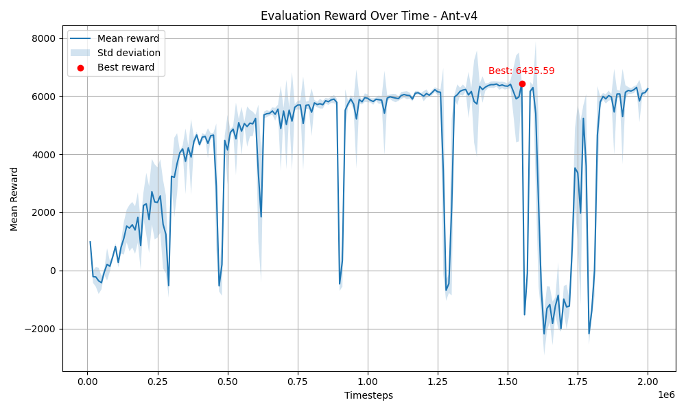
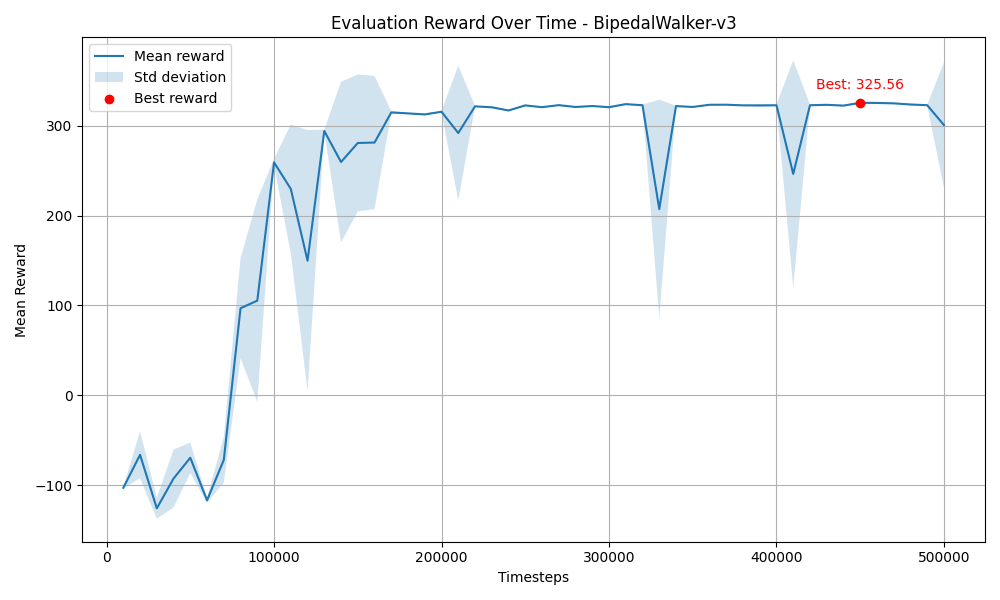
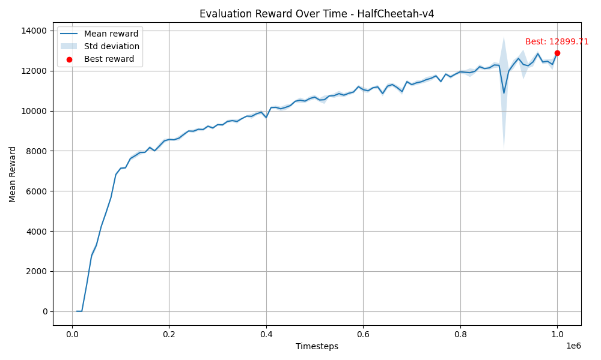
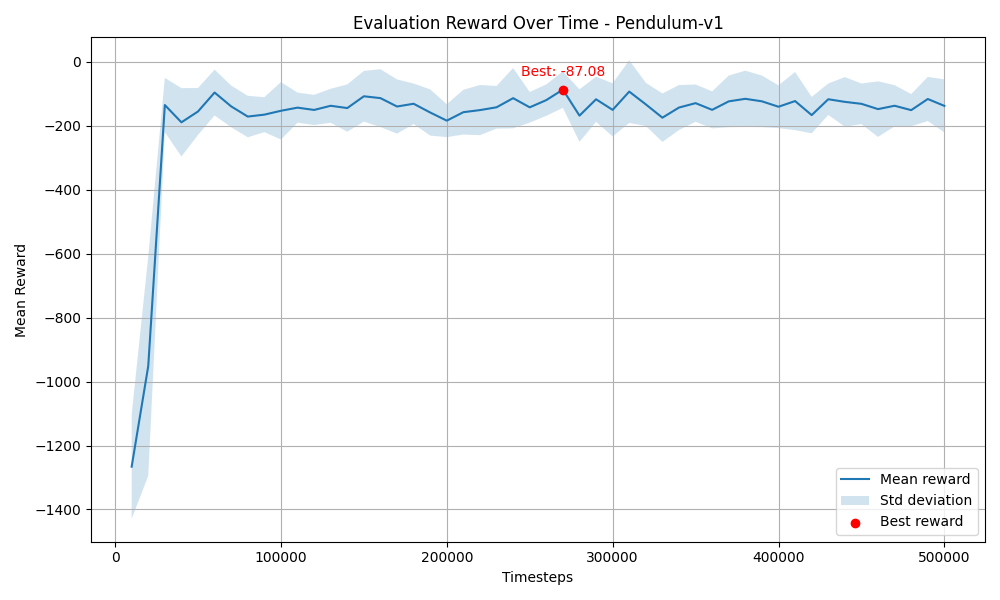
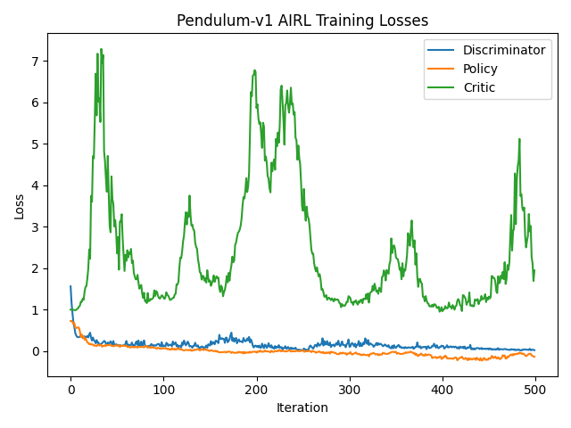
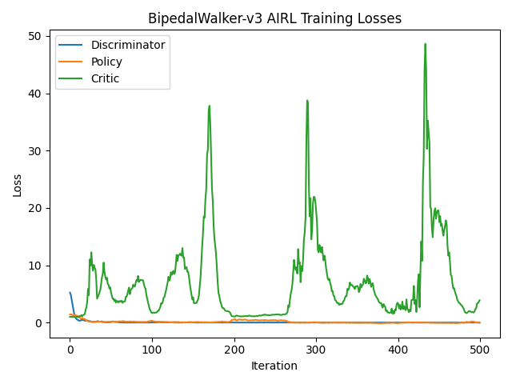
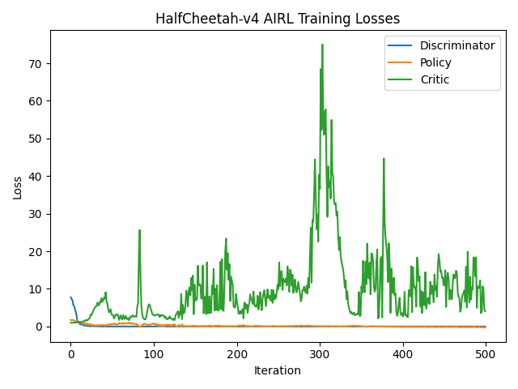
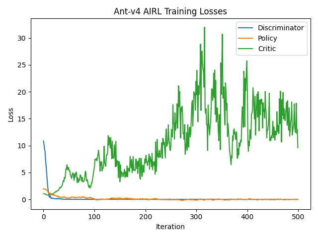

## Implementation Overview

In this project, the **Adversarial Inverse Reinforcement Learning (AIRL)** method from Fu et al. (ICLR 2018) [(paper)](https://arxiv.org/abs/1710.11248) is reproduced. The pipeline consists of three main stages:

1. **Expert Training**  
   I train expert policies in four continuous-control environments—Pendulum-v1, Swimmer-v4, HalfCheetah-v4, and Ant-v4—using Trust Region Policy Optimization (TRPO) on the true reward until performance plateaus.

2. **Expert Trajectory Collection**  
   Experts are rolled out to collect demonstration datasets of $(s, a, s')$ tuples. These expert trajectories are saved the AIRL training phase.

3. **AIRL Training**  
   The AIRL discriminator learns two functions:
   - **Reward network** $$g_\theta(s)$$: a 2-layer MLP (256 hidden units, ReLU).
   - **Shaping network** $$h_\phi(s)$$: a 2-layer MLP (256 hidden units, ReLU).

   At each iteration, the discriminator computes
   $$f_{\theta,\phi}(s, a, s') = g_\theta(s) + \gamma\,h_\phi(s') - h_\phi(s),$$
   and is trained to distinguish expert transitions from those generated by the current policy. The learned reward defined in the paper is
   $$r(s,a,s') = \log D_{\theta,\phi}(s,a,s') - \log\bigl(1 - D_{\theta,\phi}(s,a,s')\bigr),$$
   and update the policy with TRPO to maximize this learned reward. This adversarial loop continues until the recovered policy replicates expert behavior across all four environments.

   On the policy side, optimize a stochastic policy $\pi_\omega(a \mid s)$ using the Actor-Critic algorithm to maximize the objective function $E_{\pi_\omega}[\nabla_\omega \log{\pi(a|s)}\cdot\hat{A}(s,a)]$. The policy uses:
   - **Actor**: a 2-layer MLP with 256 hidden units (tanh activations) to learn action means and log standard deviation.
   - **Critic**: a learnable value function $V_\psi(s)$ (same architecture) trained using the TD method.

## Expert Performances
The following plots show the evaluation reward over time of the expert agents over the training process.
- **Ant-v4**
  
- **BipedalWalker-v3**
  
- **HalfCheetah-v4**
  
- **Pendulum-v1**
  

## AIRL Training Results

The following plots show the training losses (discriminator, policy, critic) over time for each environment:

- **Pendulum-v1**  
  

- **BipedalWalker-v3**  
  

- **HalfCheetah-v4**  
  

- **Ant-v4**  
  

---

### Performance Statistics

**Learned Reward Applied on Expert Policy and Random Policy (100 episodes)**

| Environment     | Expert Policy (mean ± std)     | Random Policy (mean ± std)      |
|-----------------|-------------------------------|----------------------------------|
| Ant-v4          | 185.4601 ± 97.3083            | -1885.2660 ± 1217.9503          |
| BipedalWalker-v3| 5390.8529 ± 158.5101          | -23215.3559 ± 20534.6100        |
| HalfCheetah-v4  | 1918.4880 ± 64.7931           | -19138.9772 ± 5351.9988         |
| Pendulum-v1     | -900.4427 ± 34.3473           | -1703.4608 ± 60.2416            |

---

**Learned Policy Performance on the Ground-truth Reward (10 episodes)**

| Environment     | Learned Policy (mean ± std)   | Random Policy (mean ± std)      |
|-----------------|-------------------------------|----------------------------------|
| Ant-v4          | -3352.62 ± 1144.61            | -81.19 ± 123.55                 |
| BipedalWalker-v3| -84.54 ± 6.04                 | -98.30 ± 11.72                  |
| HalfCheetah-v4  | -187.54 ± 0.75                | -268.55 ± 60.59                 |
| Pendulum-v1     | -389.09 ± 313.56              | -1330.67 ± 295.00               |

It's interesting to note that while the learned reward function for Pendulum-v1 is the only function that does not achieve a positive mean reward on the expert, the learned policy for Pendulum v1 notably outperforms the random policy.
